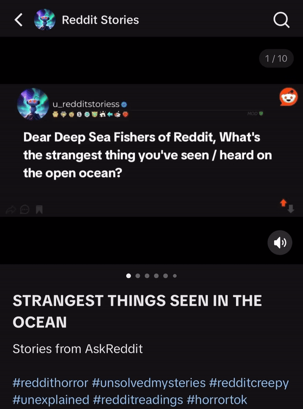

# TikTokGenerator

**TikTokGenerator** is a Python-based project designed to showcase creative use cases for the [tiktokautouploader](https://github.com/haziq-exe/TikTokAutoUploader) library. This repository generates three types of TikToks, each with a unique theme and content format. 

**While the code is public, it is not intended for users to clone and generate videos independently.**

## Features

TikTokGenerator produces the following types of TikToks:

### Reddit TTS Story  
   Generates TikToks that feature a story from Reddit, narrated with text-to-speech, combined with engaging visuals.
   

     
   

   

      <a href="https://www.tiktok.com/@u_redditstoriess">Account with full video examples</a>
   

### Will You Push The Button?
   Creates a fun, decision-making game where viewers decide whether they would "push the button" based on an ethical dilemma or hypothetical situation.

   

     
   

   

      <a href="https://www.youtube.com/@BlueVsRedButton/shorts">Account with full video examples</a>
   

### Reddit Horror Story Comments Slideshow
   Displays a collection of creepy or horror-themed comments from Reddit in a slideshow format with atmospheric sound effects.
   **NOTE:** These TikToks are not auto-uploaded as TikTok doesn't allow uploading slideshows from computers.

   

     
   

   

      <a href="https://www.tiktok.com/@u_redditstoriess">Account with full video examples</a>
   

## Purpose

The main goal of this repository is to demonstrate how the `tiktokautouploader` library can be used in creative workflows for automating TikTok video creation. While the code is open-source, it is tailored for demonstration purposes and is not structured for general use.

## How it Works

Each type of TikTok content follows its own unique pipeline:
1. **Reddit TTS Story TikTok**: 
   - Fetches a Reddit post (from subreddit and time frame of choosing).
   - Converts the text to speech.
   - Creates a Post title image.
   - Generates a video with background visuals and the TTS narration.
   - Uploads to TikTok with the [tiktokautouploader](https://github.com/haziq-exe/TikTokAutoUploader) library

2. **Will You Push The Button?**: 
   - Fetches scenarios from [Will You Press The Button?](https://willyoupressthebutton.com)
   - Uses LLM to create Image generation prompts that will be fed into text to image AI
   - Feeds afore-mentioned prompts into text to image AI and generates Images
   - Creates text for each scenario
   - Generates a video with background visuals, audio and text
   - Uploads to shorts using Google's Youtube Uploader API
   - Can also be uploaded directly to TikTok with the [tiktokautouploader](https://github.com/haziq-exe/TikTokAutoUploader) library

3. **Reddit Horror Story Comments**: 
   - Scrapes horror-related Reddit comments.
   - Creates comment images for each reddit comment.

## Installation & Usage

While the code is public, the repository is not structured to allow cloning and direct use for generating videos. You are more than welcome to go through the code though.

To explore how this code integrates with `tiktokautouploader`, refer to the [tiktokautouploader documentation](https://github.com/haziq-exe/TikTokAutoUploader).
